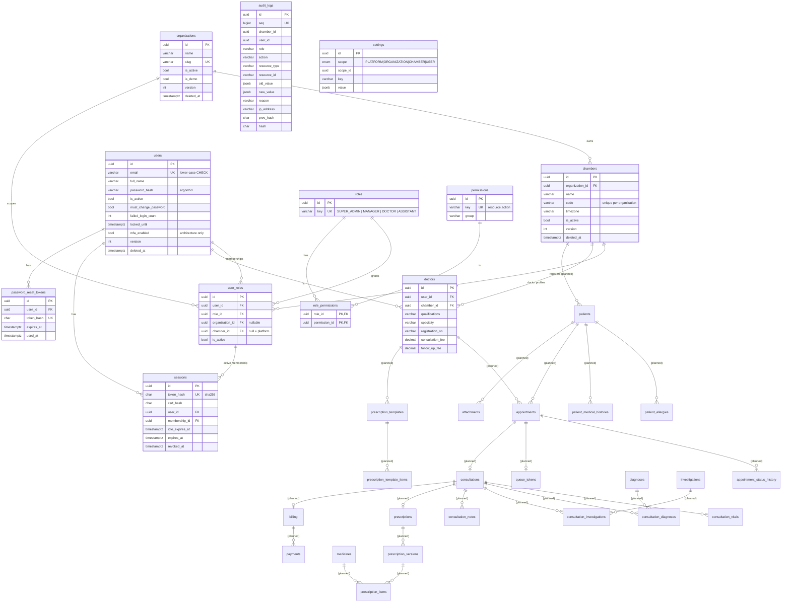

# Database design

PostgreSQL, managed with Prisma migrations (`apps/api/prisma`). Conventions:

* UUID primary keys; `snake_case` tables and columns; `timestamptz(3)` timestamps.
* `created_at` / `updated_at` on every mutable table; `version` for optimistic locking.
* Soft delete for business records: `deleted_at`, `deleted_by`, `deletion_reason`.
* Clinical records (later phases) are **versioned, never overwritten** once finalized.
* Tenant-owned rows carry `chamber_id` (+ `organization_id` where queries need it) with indexes.
* Constraints Prisma cannot express live in the migration SQL (partial unique indexes, CHECK
  constraints, the audit-log immutability trigger).

## ERD

Solid entities exist now (Phase 1). Entities marked *(planned)* arrive with their phase and
are shown so the foundation is designed for them.

## Notable constraints and indexes

| Object | Purpose |
|---|---|
| `user_roles (user_id, chamber_id)` unique + partial unique `(user_id) WHERE chamber_id IS NULL` | one membership per chamber, at most one platform membership |
| `chambers (organization_id, code)` unique | human-friendly chamber codes |
| `users_email_lowercase` CHECK | case-insensitive email uniqueness |
| `*_version_positive` CHECKs | optimistic-locking integrity |
| `audit_logs_no_update`, `audit_logs_no_truncate` triggers | append-only audit trail |
| `audit_logs (chamber_id, created_at)`, `(user_id, created_at)`, `(resource_type, resource_id)` | scoped, filtered audit queries |
| `sessions.token_hash` unique | O(1) session lookup |

## Planned (next phases)

* **Patients** — `patients` (chamber-scoped patient code, demographics, trigram indexes for
  fuzzy name/phone search), `patient_contacts`, `patient_allergies`, `patient_medical_histories`.
* **Appointments & queue** — status history table, exclusion/unique constraints to prevent
  double booking, daily token sequences per chamber.
* **Clinical** — consultations with configurable vitals (key/value definitions, not hard-coded
  columns), ICD-compatible `diagnoses.code`.
* **Prescriptions** — `prescriptions` (RX number, state machine DRAFT → FINALIZED → REVISED →
  SUPERSEDED), immutable `prescription_versions` + `prescription_items`, unique constraint
  preventing two finalized versions for the same revision.
