# Database design

PostgreSQL, managed with Prisma migrations (`apps/api/prisma`). Conventions:

* UUID primary keys; `snake_case` tables and columns; `timestamptz(3)` timestamps.
* `created_at` / `updated_at` on every mutable table; `version` for optimistic locking.
* Soft delete for business records: `deleted_at`, `deleted_by`, `deletion_reason`.
* Clinical records (later phases) are **versioned, never overwritten** once finalized.
* Tenant-owned rows carry `chamber_id` (+ `organization_id` where queries need it) with indexes.
* Constraints Prisma cannot express live in the migration SQL (partial unique indexes, CHECK
  constraints, the audit-log immutability trigger).

## ERD

Solid entities exist now (Phase 1). Entities marked *(planned)* arrive with their phase and
are shown so the foundation is designed for them.

```mermaid
erDiagram
    organizations ||--o{ chambers : owns
    organizations ||--o{ user_roles : scopes
    chambers ||--o{ user_roles : scopes
    chambers ||--o{ doctors : "doctor profiles"
    users ||--o{ user_roles : "memberships"
    users ||--o{ doctors : "is"
    users ||--o{ sessions : has
    users ||--o{ password_reset_tokens : has
    roles ||--o{ user_roles : grants
    roles ||--o{ role_permissions : has
    permissions ||--o{ role_permissions : in
    user_roles ||--o{ sessions : "active membership"

    chambers ||--o{ patients : registers
    patients ||--o{ patient_contacts : "emergency contacts"
    patients ||--o{ patient_allergies : has
    patients ||--o| patient_medical_histories : has
    patients ||--o{ patient_recent_views : "recently opened by"
    chambers ||--|| patient_code_sequences : numbers
    patients ||--o{ appointments : books
    doctors ||--o{ appointments : sees
    doctors ||--o{ doctor_schedule_windows : "weekly availability"
    appointments ||--o{ appointment_status_history : "history"
    appointments ||--o| queue_tokens : "token"
    chambers ||--o{ queue_token_sequences : "daily counters"
    appointments ||--o| consultations : "visit"
    consultations ||--o{ consultation_vitals : vitals
    vital_definitions ||--o{ consultation_vitals : defines
    consultations ||--o{ consultation_symptoms : complaints
    complaints ||--o{ consultation_symptoms : "catalogue"
    consultations ||--o{ consultation_diagnoses : diagnoses
    consultations ||--o{ consultation_investigations : orders
    consultations ||--o{ consultation_notes : "private notes & addenda"
    consultations ||--o| prescriptions : "prescription"
    prescriptions ||--o{ prescription_versions : "immutable versions"
    prescription_versions ||--o{ prescription_items : medicines
    medicines ||--o{ prescription_items : "catalogue"
    chambers ||--o{ medicines : "chamber medicines (NULL = global)"
    doctors ||--o{ doctor_medicine_favorites : favourites
    medicines ||--o{ doctor_medicine_favorites : ""
    chambers ||--|| prescription_sequences : "Rx numbers"
    diagnoses ||--o{ consultation_diagnoses : "catalogue"
    investigations ||--o{ consultation_investigations : "catalogue"
    chambers ||--o{ prescription_templates : "shared templates"
    doctors ||--o{ prescription_templates : "personal templates"
    prescription_templates ||--o{ prescription_template_items : medicines
    appointments ||--o{ invoices : "bill (one active)"
    patients ||--o{ invoices : billed
    invoices ||--o{ invoice_items : charges
    invoices ||--o{ payments : "ledger (payments & refunds)"
    chambers ||--o{ fee_items : "fee schedule"
    investigations ||--o{ fee_items : "priced"
    chambers ||--o{ billing_sequences : "INV / RCPT / RF numbers"
    patients ||--o{ attachments : "(planned)"

    organizations {
      uuid id PK
      varchar name
      varchar slug UK
      bool is_active
      bool is_demo
      int version
      timestamptz deleted_at
    }
    chambers {
      uuid id PK
      uuid organization_id FK
      varchar name
      varchar code "unique per organization"
      varchar timezone
      bool is_active
      int version
      timestamptz deleted_at
    }
    users {
      uuid id PK
      varchar email UK "lower-case CHECK"
      varchar full_name
      varchar password_hash "argon2id"
      bool is_active
      bool must_change_password
      int failed_login_count
      timestamptz locked_until
      bool mfa_enabled "architecture only"
      int version
      timestamptz deleted_at
    }
    roles {
      uuid id PK
      varchar key UK "SUPER_ADMIN | MANAGER | DOCTOR | ASSISTANT"
    }
    permissions {
      uuid id PK
      varchar key UK "resource.action"
      varchar group
    }
    role_permissions {
      uuid role_id PK,FK
      uuid permission_id PK,FK
    }
    user_roles {
      uuid id PK
      uuid user_id FK
      uuid role_id FK
      uuid organization_id FK "nullable"
      uuid chamber_id FK "null = platform"
      bool is_active
    }
    doctors {
      uuid id PK
      uuid user_id FK
      uuid chamber_id FK
      varchar qualifications
      varchar specialty
      varchar registration_no
      decimal consultation_fee
      decimal follow_up_fee
      text signature_data_url
      varchar prescription_footer
    }
    sessions {
      uuid id PK
      char token_hash UK "sha256"
      char csrf_hash
      uuid user_id FK
      uuid membership_id FK
      timestamptz idle_expires_at
      timestamptz expires_at
      timestamptz revoked_at
    }
    password_reset_tokens {
      uuid id PK
      uuid user_id FK
      char token_hash UK
      timestamptz expires_at
      timestamptz used_at
    }
    audit_logs {
      uuid id PK
      bigint seq UK
      uuid chamber_id
      uuid user_id
      varchar role
      varchar action
      varchar resource_type
      varchar resource_id
      jsonb old_value
      jsonb new_value
      varchar reason
      varchar ip_address
      char prev_hash
      char hash
    }
    patients {
      uuid id PK
      uuid chamber_id FK
      varchar patient_code "unique per chamber"
      varchar full_name "trigram index"
      enum gender
      date date_of_birth
      bool dob_estimated
      varchar blood_group "CHECK"
      varchar phone
      varchar phone_search "normalized digits, trigram index"
      varchar email
      int version
      timestamptz deleted_at
    }
    patient_allergies {
      uuid id PK
      uuid patient_id FK
      varchar allergen
      enum severity
      timestamptz deleted_at
    }
    patient_medical_histories {
      uuid id PK
      uuid patient_id UK
      varchar existing_conditions
      varchar current_medications
      varchar family_history
      int version
    }
    appointments {
      uuid id PK
      uuid chamber_id FK
      uuid patient_id FK
      uuid doctor_id FK
      timestamptz starts_at
      timestamptz ends_at
      enum status
      enum visit_type
      bool is_overbooked
      varchar cancelled_reason
      int version
    }
    queue_tokens {
      uuid id PK
      uuid appointment_id UK
      date queue_date
      varchar scope_key "doctor id or ALL"
      int token_number
      bool on_hold
      timestamptz called_at
    }
    prescriptions {
      uuid id PK
      uuid consultation_id UK
      varchar rx_number "RX-000145, unique per chamber"
      enum status "DRAFT|FINALIZED|REVISED|CANCELLED"
      int current_version
      timestamptz issued_at
      int version
    }
    prescription_versions {
      uuid id PK
      uuid prescription_id FK
      int version_number
      enum status "DRAFT|FINALIZED|SUPERSEDED|DISCARDED"
      varchar advice
      varchar revision_reason
      timestamptz finalized_at
      timestamptz superseded_at
      varchar verification_token UK
      varchar content_hash "SHA-256"
    }
    prescription_items {
      uuid id PK
      uuid version_id FK
      uuid medicine_id FK "nullable (free text)"
      varchar name "snapshot"
      varchar strength
      enum form
      varchar dose
      varchar frequency "e.g. 1+0+1"
      int duration_value
      enum duration_unit
      int quantity
      enum meal_instruction
    }
    medicines {
      uuid id PK
      uuid chamber_id "NULL = global"
      varchar generic_name
      varchar brand_name
      enum form
      varchar strength
      text_array common_frequencies
      bool is_active
    }
    invoices {
      uuid id PK
      varchar invoice_number "INV-000123"
      enum status "UNPAID|PARTIALLY_PAID|PAID|VOID"
      numeric subtotal
      numeric discount_amount
      numeric total
      numeric paid_amount "payments - refunds"
      numeric due_amount
      varchar void_reason
      int version
    }
    payments {
      uuid id PK
      uuid invoice_id FK
      enum kind "PAYMENT|REFUND"
      varchar receipt_number "RCPT-/RF-"
      numeric amount
      enum method "CASH|CARD|MOBILE_BANKING|BANK_TRANSFER|OTHER"
      varchar provider "bKash, Visa…"
      varchar reference "never a full card number"
      varchar reason
    }
    settings {
      uuid id PK
      enum scope "PLATFORM|ORGANIZATION|CHAMBER|USER"
      uuid scope_id
      varchar key
      jsonb value
    }
```

## Notable constraints and indexes

| Object | Purpose |
|---|---|
| `user_roles (user_id, chamber_id)` unique + partial unique `(user_id) WHERE chamber_id IS NULL` | one membership per chamber, at most one platform membership |
| `chambers (organization_id, code)` unique | human-friendly chamber codes |
| `users_email_lowercase` CHECK | case-insensitive email uniqueness |
| `*_version_positive` CHECKs | optimistic-locking integrity |
| `audit_logs_no_update`, `audit_logs_no_truncate` triggers | append-only audit trail |
| `audit_logs (chamber_id, created_at)`, `(user_id, created_at)`, `(resource_type, resource_id)` | scoped, filtered audit queries |
| `sessions.token_hash` unique | O(1) session lookup |
| `patients (chamber_id, patient_code)` unique + `patient_code_sequences` (atomic `INSERT … ON CONFLICT … RETURNING`) | gap-free, race-free patient IDs per chamber |
| `patients_full_name_trgm`, `patients_phone_search_trgm` (GIN, `pg_trgm`, partial on `deleted_at IS NULL`) | partial / typo-tolerant search |
| `patients (chamber_id, phone_search / date_of_birth / email / created_at)` | exact lookups, duplicate checks, date filters |
| `appointments_no_doctor_overlap` (EXCLUDE USING gist on `doctor_id` + `tstzrange`, active and not overbooked) | a doctor can never be double-booked, even under concurrent requests |
| `appointments_no_patient_overlap` (EXCLUDE USING gist on `patient_id` + `tstzrange`, active) | a patient can never be in two appointments at once |
| `queue_tokens (chamber_id, scope_key, queue_date, token_number)` unique + `queue_token_sequences` | race-free daily token numbers |
| `appointments_cancel_reason`, `appointments_ends_after_start`, `doctor_schedule_windows_valid` CHECKs | data integrity |
| `consultations_immutable`, `consultations_no_delete` + child-table triggers | finalized consultations cannot change; consultations are never deleted; only ADDENDUM notes may be appended |
| `consultation_diagnoses_one_primary`, `consultation_notes_one_clinical` (partial unique) | one primary diagnosis, one private note per consultation |
| `*_scope_name_unique`, `diagnoses_scope_code_unique` (expression indexes) | no duplicate catalogue names/codes per scope (global or chamber) |
| `diagnoses_name_trgm`, `investigations_name_trgm`, `complaints_name_trgm` | typo-tolerant catalogue search |
| `patients_blood_group_valid`, `patients_email_lowercase`, `patients_dob_after_1900` CHECKs | data integrity |
| `prescription_versions_immutable` trigger | issued versions never change; the only permitted update is FINALIZED → SUPERSEDED (with `superseded_at`); versions are never deleted |
| `prescription_items_protect` trigger | items can only be written while their version is a DRAFT |
| `prescriptions_protect` trigger | prescriptions are never deleted; Rx number, patient, doctor and issue date never change; no transition back to DRAFT |
| `prescription_versions_one_finalized`, `prescription_versions_one_draft` (partial unique) | exactly one current version and at most one open draft per prescription |
| `prescriptions (chamber_id, rx_number)` unique + `prescription_sequences` | race-free Rx numbers per chamber |
| `prescription_versions_finalized_fields`, `prescription_versions_revision_reason`, `prescriptions_issued_fields` CHECKs | issued versions always carry finalizer, token and hash; revisions always carry a reason |
| `medicines_scope_unique` (expression index), `medicines_generic_trgm`, `medicines_brand_trgm` | no duplicate medicine per scope; typo-tolerant medicine search |
| `prescription_templates_owner_name_unique` | template names unique per doctor / per chamber for shared templates |
| `invoices_amounts_valid`, `invoices_status_consistent`, `invoices_discount_reason`, `invoice_items_amount_valid` CHECKs | total = subtotal − discount; 0 ≤ paid ≤ total; due = total − paid; status always matches the amounts; discounts carry a reason |
| `payments_append_only` trigger + `payments_amount_positive`, `payments_refund_reason` CHECKs | the money ledger is never edited or deleted; refunds always have a reason |
| `invoices_protect`, `invoice_items_protect` triggers | bills are never deleted; void bills and their items never change; number/patient/chamber immutable |
| `invoices_one_per_appointment` (partial unique, non-void) | one active bill per visit |
| `invoices (chamber_id, invoice_number)`, `payments (chamber_id, receipt_number)` unique + `billing_sequences` | race-free bill and receipt numbers per chamber |
| `invoices_open_dues` (partial index on open bills) | fast outstanding-dues queries |
| `doctors_signature_data_url_valid` CHECK | the signature is only ever an image data URL (PNG/JPEG/WebP) |
| `consultations_chamber_finalized` (partial index on finalized consultations) | fast clinical reports by chamber and date |
| `settings` keys `chamber_profile` (CHAMBER) and `security` (PLATFORM) | chamber logo, tagline and opening hours; the platform security policy |
| `patients_code_trgm`, `patients_email_trgm` (GIN, `pg_trgm`, partial) | every branch of the patient-search OR is indexable, so no sequential scans (Phase 8) |
| `ALTER DATABASE … SET jit = off` (migration) | JIT compilation cost ~400 ms per report query without benefit for this workload |

## Planned (next phases)

* **Attachments** — patient documents and report files.
